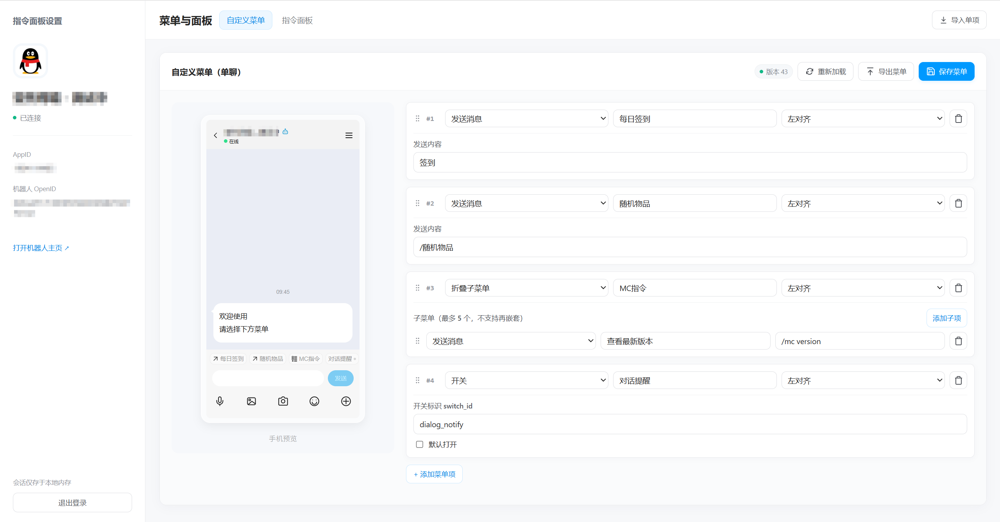
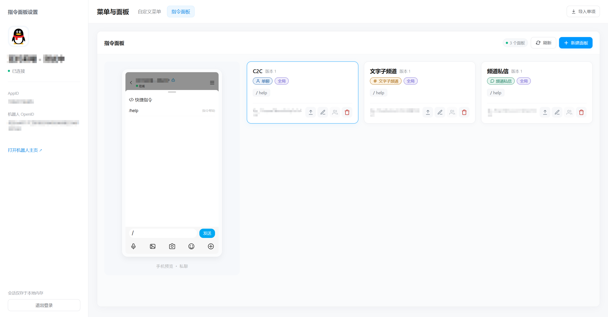

### 本项目与开放平台无关，也不是官方产品，仅为个人分享工具，请您知晓

# 指令面板设置

QQ 机器人自定义菜单与指令面板配置工具。支持菜单及子项拖动排序、四种聊天场景、关联对象管理和 JSON 导入导出。

本地运行，使用 AppID / AppSecret 登录；凭据仅存于进程内存，不写入文件。登录和同步配置需要联网。

## 预览

### 自定义菜单



### 指令面板



## 使用

需要 **Node.js ≥ 22.13.0**。

1. 解压分发包，Windows 运行 `start.cmd`，macOS / Linux 执行 `sh start.sh`。
2. 打开 `http://127.0.0.1:4973`，输入 AppID 和 AppSecret 登录。
3. 编辑配置并保存。使用期间保持终端运行，`Ctrl+C` 关闭服务。

分发包无需安装依赖。端口可通过环境变量 `PANEL_HELPER_PORT` 修改。

## 开发

```sh
npm ci
npm run dev
```

```sh
npm test         # 模拟接口测试
npm run build    # 构建前端
npm start        # 运行构建后的应用
npm run release  # 生成 ZIP 与 SHA-256，输出至 release/
```

## 文档

[使用说明](docs/user-guide.md) · [开发约定](docs/architecture.md) · [安全说明](SECURITY.md) · [第三方声明](THIRD_PARTY_NOTICES.md)

## LICENSE

[MIT](LICENSE)
